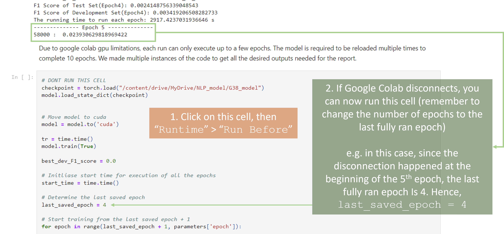

# CZ4045-NLPProject
CZ4045 Natural Language Processing Group Project

### Required Submission Files
* PDF Report containing write-ups describing design of neural networks and answers to questions
* README.txt which gives instructions to run the code and explanations of sample output obtained from your code
* Relevant source code (e.g. Part1 and Part2 IPYNB files)

### Dataset for Part 1 obtained from this link: 
https://github.com/TheAnig/NER-LSTM-CNN-Pytorch/tree/master/data

> Disclaimer: Personally only worked on Part 1

### Part 1 Remarks:
Part 1 will take really long to train (~8hrs for 10 epochs, excluding the time needed to reload the model as Google Colab disconnected) so do be prepared to allocate it enough time for training.

Follow the instructions in the image above carefully, especially if you need to reload the model after a Google Colab disconnection.

We only ran the model for 10 epochs due to time constraints and this [reference](https://datascience.stackexchange.com/questions/9819/number-of-epochs-in-gensim-word2vec-implementation), so do feel free to try to run it for more epochs to get better results for the model.
